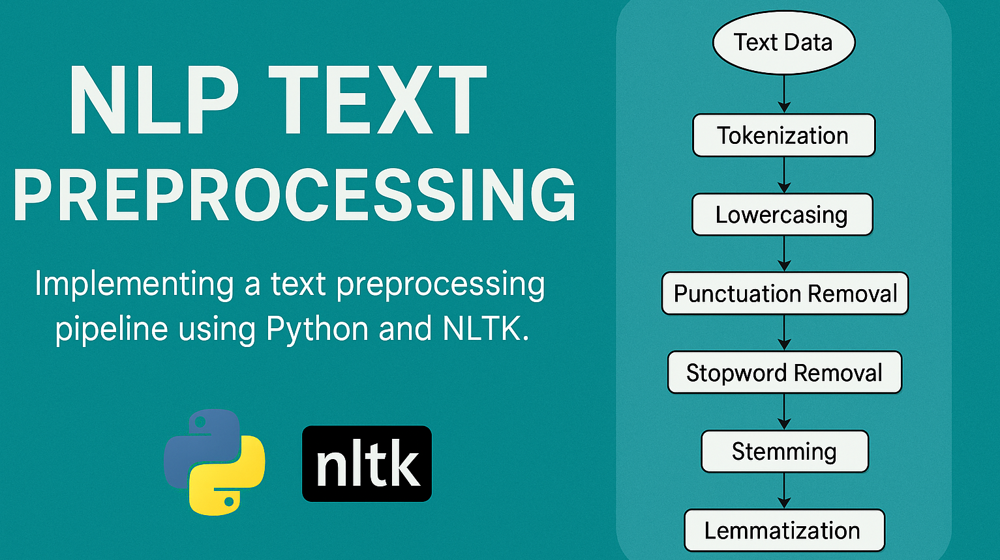

# NLP-Text-Preprocessing
A comprehensive Natural Language Processing (NLP) pipeline built with NLTK to clean, tokenize, normalize, and prepare textual data for advanced language modeling and analysis.

## 📌 Overview
This project demonstrates end-to-end **text preprocessing** techniques using NLTK, applied to documents describing various hobbies. Core steps include:
- Tokenization of raw text and conversion to lowercase
- Removal of punctuation and stopwords (including custom words)
- Stemming and lemmatization using **PorterStemmer** and **WordNetLemmatizer**
- Prepares text for further NLP tasks such as classification, summarization, or topic modeling

## 🛠️ Tech Stack
- **Platform**: Jupyter Notebook (or Google Colab)
- **Languages**: Python
- **Libraries**: NLTK
- **Data**: Custom multi-document corpus of descriptive hobby texts

## 📂 Key Features
- ✅ Tokenizes text and removes case sensitivity
- ✅ Removes punctuation and common English stopwords
- ✅ Performs stemming and lemmatization to normalize words
- ✅ Modular structure ideal for reuse in other NLP pipelines
